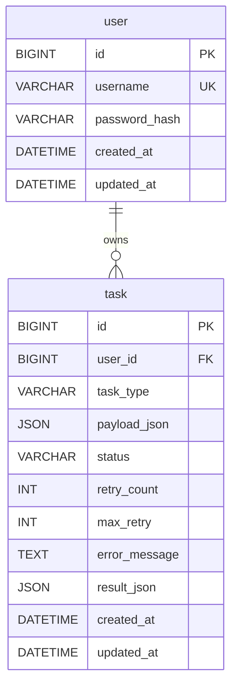

# async-forge 数据库设计文档

> 依据：`database/sql/schema.sql`  
> 引擎：MySQL 8 · 字符集 `utf8mb4` · 排序规则 `utf8mb4_unicode_ci`  
> 库名：`async_forge`

本文档描述当前已落地的最小表结构，对应 P0：用户鉴权与异步任务持久化。消息投递、重试与死信由 RabbitMQ 承担；库表负责任务元数据、状态机与用户隔离。

---

## 1. 设计目标

| 目标 | 说明 |
|------|------|
| 用户隔离 | 任务按 `user_id` 归属，查询必须带当前用户条件 |
| 任务可观测 | 持久化类型、payload、状态、重试次数、错误与结果 |
| 消费幂等 | 通过状态条件更新（`PENDING`/`FAILED` → `RUNNING`）避免重复执行副作用 |
| 密钥不入库 | 仅存 BCrypt 密码哈希；JWT / MQ / AI Key 走环境变量 |

---

## 2. ER 关系

当前仅两张表，一对多：

```text
user 1 ──── N task
```



---

## 3. 表结构

### 3.1 `user` — 用户

存储可登录账号。密码仅保存哈希，不存明文。

| 字段              | 类型             | 空  | 默认值                           | 说明        |
|-----------------|----------------|----|-------------------------------|-----------|
| `id`            | `BIGINT`       | NO | AUTO_INCREMENT                | 主键        |
| `username`      | `VARCHAR(64)`  | NO | —                             | 登录名，全局唯一  |
| `password_hash` | `VARCHAR(255)` | NO | —                             | BCrypt 哈希 |
| `created_at`    | `DATETIME`     | NO | `CURRENT_TIMESTAMP`           | 创建时间      |
| `updated_at`    | `DATETIME`     | NO | `CURRENT_TIMESTAMP ON UPDATE` | 更新时间      |

**约束与索引**

| 名称                 | 类型     | 列          | 用途         |
|--------------------|--------|------------|------------|
| `PRIMARY KEY`      | PK     | `id`       | 主键         |
| `uk_user_username` | UNIQUE | `username` | 防重复注册、登录查找 |

---

### 3.2 `task` — 异步任务

任务创建后立即入库并投递 MQ；Worker 消费时更新状态与结果。`id` 即业务侧的 `taskId`，消息体至少携带该字段。

| 字段              | 类型            | 空   | 默认值                           | 说明                  |
|-----------------|---------------|-----|-------------------------------|---------------------|
| `id`            | `BIGINT`      | NO  | AUTO_INCREMENT                | 主键 / taskId         |
| `user_id`       | `BIGINT`      | NO  | —                             | 所属用户，外键 → `user.id` |
| `task_type`     | `VARCHAR(32)` | NO  | —                             | 任务类型，见 §4.1         |
| `payload_json`  | `JSON`        | NO  | —                             | 创建时入参（如 URL、睡眠秒数）   |
| `status`        | `VARCHAR(16)` | NO  | `'PENDING'`                   | 状态机，见 §4.2          |
| `retry_count`   | `INT`         | NO  | `0`                           | 已失败重试次数（失败一次 +1）    |
| `max_retry`     | `INT`         | NO  | `3`                           | 最大重试次数；耗尽后置 `DEAD`  |
| `error_message` | `TEXT`        | YES | `NULL`                        | 最近一次失败原因摘要          |
| `result_json`   | `JSON`        | YES | `NULL`                        | 成功时的执行结果摘要          |
| `created_at`    | `DATETIME`    | NO  | `CURRENT_TIMESTAMP`           | 创建时间                |
| `updated_at`    | `DATETIME`    | NO  | `CURRENT_TIMESTAMP ON UPDATE` | 状态变更时间              |

**约束与索引**

| 名称                 | 类型  | 列                      | 用途               |
|--------------------|-----|------------------------|------------------|
| `PRIMARY KEY`      | PK  | `id`                   | 主键；MQ 消息以该 ID 关联 |
| `idx_task_user_id` | KEY | `user_id`              | 当前用户任务列表         |
| `idx_task_status`  | KEY | `status`               | 按状态筛选 / 运维排查     |
| `fk_task_user`     | FK  | `user_id` → `user(id)` | 引用完整性            |

---

## 4. 枚举与业务约定

库表用字符串存储枚举名，由应用层校验合法值（非 MySQL ENUM）。

### 4.1 任务类型（P0）

| `task_type`  | 含义                                    |
|--------------|---------------------------------------|
| `HTTP_CALL`  | 按 `payload_json` 请求外部 HTTP，记录状态码与响应摘要 |
| `DELAY_DEMO` | 睡眠 N 秒；可由 payload 强制失败，用于演示重试与死信      |

后续扩展（如 `AGENT_TOOL`）应继续走策略/执行器注册，不改表结构，仅新增类型值。

### 4.2 任务状态

| `status`  | 含义                                       |
|-----------|------------------------------------------|
| `PENDING` | 已入库，等待投递或等待再次消费                          |
| `RUNNING` | Worker 已抢占，执行中                           |
| `SUCCESS` | 执行成功（终态）                                 |
| `FAILED`  | 失败且仍可能被重试策略处理（可与 `PENDING` 配合；抢占条件包含该状态） |
| `DEAD`    | 重试耗尽或进入死信后的终态，保留 `error_message`         |

**建议流转**

```text
创建 → PENDING
  →（投递 MQ）→ 条件更新 RUNNING
  → SUCCESS
  → 失败且 retry_count < max_retry → PENDING（重新入队）
  → 失败且 retry_count ≥ max_retry → DEAD
  →（DLQ 监听兜底）→ DEAD
```

**语义说明（与实现一致）**

- `FAILED`：表示失败但仍在重试生命周期内的可选中间态；当前失败回写多为 `PENDING`（待重投）或直接 `DEAD`。
- `DEAD`：终态，不再自动执行；可配合 P1「手动重试」重新入队。
- 幂等：对 `SUCCESS` / `DEAD` 的重复消息直接跳过；抢占使用  
  `UPDATE ... WHERE status IN ('PENDING','FAILED')`，`RUNNING` 中的重复投递不会二次执行。

**重试计数约定**

- 创建时 `retry_count = 0`，`max_retry` 默认 `3`。
- 每次业务失败：`retry_count := retry_count + 1`；若 `retry_count >= max_retry` 则置 `DEAD`，否则置 `PENDING` 并重新投递。

---

## 5. 与中间件的边界

| 职责             | 落点                                                |
|----------------|---------------------------------------------------|
| 任务元数据、状态、结果、错误 | MySQL `task`                                      |
| 异步投递、消费、死信队列   | RabbitMQ（非 DB）                                    |
| 消费幂等（P0）       | DB 状态条件更新；可选 Redis Key `idempotent:task:{taskId}` |
| 创建限流（P1）       | Redis `rate:task:create:{userId}`，不扩表             |

任务表**不**存 MQ delivery tag、routing key 等中间件细节，避免与 Broker 状态双写耦合。

---

## 6. 初始化与演进

### 6.1 初始化

Docker Compose 启动 MySQL 时挂载并执行：

```text
database/sql/schema.sql
```

脚本幂等：`CREATE DATABASE IF NOT EXISTS` / `CREATE TABLE IF NOT EXISTS`。

### 6.2 规划中表（不是当前交付）

P2 **不加** `task_step` / `ai_call_log`（耗时写入 `result_json.durationMs` 与日志即可）。见 `.cursor/rules/compose-secrets.mdc` 与 skill `implement-p2-agent` 的「明确不做」。

| 表名            | 原规划阶段 | 用途                                |
|---------------|--------|-----------------------------------|
| `task_step`   | P1     | 顺序工作流步骤（step1 → step2 → …）        |
| `ai_call_log` | P2     | Agent / LLM 调用耗时与成败日志（不含 API Key） |

---

## 7. 安全与隐私（库侧）

- 不存 JWT、明文密码、AI API Key。
- `payload_json` / `result_json` / `error_message` 可能含外部 URL 或业务摘要，日志打印时需截断，避免泄露敏感字段。
- `HTTP_CALL` 的目标地址由应用层约束，库层不做 SSRF 校验。

---

## 8. DDL 源文件

完整建库建表语句见：

[`database/sql/schema.sql`](./sql/schema.sql)
