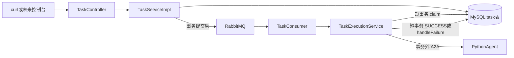
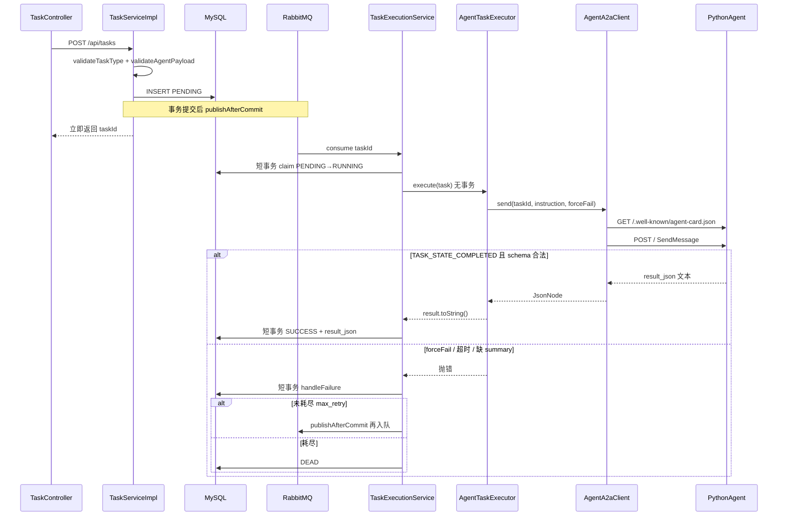

# Java 接入 AGENT_TASK（P2 步骤 B）

本文记录 **为什么这样改**、**每个改动文件做什么**、**一次任务怎么走**。启动与 curl 以 [README.md](../../README.md) 为准；A2A 字段以 [a2a-contract.md](../../.cursor/skills/python-a2a-mcp/a2a-contract.md) 为准；操作清单以 skill [extend-task-executor](../../.cursor/skills/extend-task-executor/SKILL.md) 为准。

Python 侧骨架见 [Python-Agent骨架搭建.md](Python-Agent骨架搭建.md)。本步 **没有** 改 `agent/` 里的 LangGraph / MCP（那是步骤 C），也 **没有** 改控制台表单（那是步骤 D）。

## 1. 这一步要解决什么

步骤 A 已经让 Python 能独立回答 A2A：`forceFail=false` 返回固定成功 JSON，`forceFail=true` 返回 Task failed。步骤 B 把这条链路接到 Java 任务平台上：

| 层 | 本步做了什么 | 禁止 |
|----|----------------|------|
| Java | 新类型 `AGENT_TASK`、创建校验、A2A Client、执行器、拆事务 | 加 LLM SDK；用 `HTTP_CALL` 打 Agent；`@Async` 替换 MQ |
| Python | 不改（继续用 stub） | 连 MySQL / RabbitMQ |
| 前端 | 不改 | 浏览器直连 Agent |

Agent 仍然只是一种任务类型，失败走 **同一套** `handleFailure`（重试 → `DEAD`），不是新平台。

本步已完成：

- `POST /api/tasks` 接受 `taskType=AGENT_TASK`，空 `instruction` 返回业务码 `40000`
- Worker 阻塞调用 Python A2A `SendMessage`
- stub 成功 → 任务 `SUCCESS`，`result.summary` 非空，`result.toolCalls` 为数组（stub 为 `[]`）
- `forceFail=true` → 经 A2A failed → 现有重试 → `DEAD`
- `DELAY_DEMO` / `HTTP_CALL` 演示语义不变



## 2. 改了哪些文件

提交 `18f95a9`。按职责分组。规格文档（skill / 交接 / README）不是运行时代码，文末单独列。

### 2.1 新建（Java `agent` 包只允许这两个类）

| 文件 | 职责 |
|------|------|
| [AgentProperties.java](../../backend/src/main/java/com/phrolova/asyncforge/agent/AgentProperties.java) | 绑定 `async-forge.agent.base-url` / `timeout-seconds` |
| [AgentA2aClient.java](../../backend/src/main/java/com/phrolova/asyncforge/agent/AgentA2aClient.java) | 拉 Card → `SendMessage` → 抽出 JSON；失败抛错 |
| [AgentTaskExecutor.java](../../backend/src/main/java/com/phrolova/asyncforge/worker/AgentTaskExecutor.java) | `taskType()=AGENT_TASK`；校验结果 schema；**不**改任务状态 |

执行器必须放 `worker/`，与 `HttpCallExecutor` / `DelayDemoExecutor` 并列。`pom.xml` **没有**加 LLM SDK。

### 2.2 修改

| 文件 | 改了什么 |
|------|----------|
| [TaskType.java](../../backend/src/main/java/com/phrolova/asyncforge/entity/TaskType.java) | 枚举增加 `AGENT_TASK` |
| [TaskServiceImpl.java](../../backend/src/main/java/com/phrolova/asyncforge/service/impl/TaskServiceImpl.java) | 创建时校验 `instruction` |
| [TaskExecutionService.java](../../backend/src/main/java/com/phrolova/asyncforge/service/TaskExecutionService.java) | 拆事务：claim / 远程调用 / 写结果 |
| [application.yml](../../backend/src/main/resources/application.yml) | `async-forge.agent.*` |

### 2.3 没改、但必须知道它怎么工作

| 文件 | 为什么没改 |
|------|------------|
| `TaskExecutor.java` | 接口仍是 `taskType()` + `execute(Task)` |
| `TaskExecutorRegistry.java` | 构造时收集所有 `@Component` 实现；新执行器自动入表，禁止巨型 switch |
| `HttpCallExecutor.java` / `DelayDemoExecutor.java` | 演示语义不动；禁止把 Agent URL 交给 HTTP_CALL（SSRF 会拦 Docker 名 `agent`） |
| `TaskProducer.java` / `TaskConsumer.java` | 仍是一条 `taskId` 消息；手动 ACK |
| `database/sql/schema.sql` | `task_type` 已是 `VARCHAR(32)`，P2 不改表 |

## 3. 一次 AGENT_TASK 怎么走

创建请求 payload（不要在 Java 里解析用户 URL；是否调 `http_get` 由步骤 C 的 Agent 决定）：

```json
{
  "taskType": "AGENT_TASK",
  "payload": {
    "instruction": "hello",
    "forceFail": false
  }
}
```



关键约束：

1. HTTP 创建接口 **不等待** Agent。和 `DELAY_DEMO` 一样，先入库再入队。
2. A2A 可能要几十秒，**绝不能**占着数据库事务（连接、行锁）。这是本步拆 `TaskExecutionService` 的原因。
3. `forceFail` **必须发给 Python**。Java 里看到 `true` 就直接 throw，等于没测通 A2A failed 路径。

## 4. 按文件讲解

### 4.1 `TaskType.java`：多一个枚举值

```java
public enum TaskType {
    HTTP_CALL,
    DELAY_DEMO,
    AGENT_TASK
}
```

`validateTaskType` 本来就是 `Arrays.stream(TaskType.values())`，加枚举后创建接口自动放开未知类型仍返回 `TASK_TYPE_UNSUPPORTED`。

不改表：`task.task_type` 是字符串，写入的是 `"AGENT_TASK"` 这几个字符。

### 4.2 `TaskServiceImpl.java`：创建时的第一道闸

只在 `taskType` 为 `AGENT_TASK` 时校验 payload，不影响 `HTTP_CALL` 的 `url` / `DELAY_DEMO` 的 `seconds`。

```text
validateAgentPayload
  payload 必须是 JSON 对象
  instruction 必须是字符串
  trim 后非空
  长度 ≤ 2000
  forceFail 不强制：缺省由执行器按 false 处理
```

失败抛 `BusinessException(ErrorCode.BAD_REQUEST, ...)`。本项目 Controller 统一返回 `{ code, message, data }`，HTTP 仍是 200，**业务码 `40000`**。这和空用户名、非法 payload 的现有风格一致，不是 HTTP 400。

不要在这里解析 instruction 里的 URL。用户写 `GET https://httpbin.org/json` 只是自然语言，Java 当普通字符串存进 `payload_json`。

执行器里还有 **第二道闸**（空 instruction 抛错会进重试）。正常请求过不了第一道闸；第二道是防脏数据或绕过 API 直接改库。

创建成功后仍走原逻辑：`PENDING` 入库 → `publishAfterCommit` → 立刻返回 `taskId`。

### 4.3 `application.yml` + `AgentProperties.java`：Java 怎么找到 Agent

```yaml
async-forge:
  agent:
    base-url: ${AGENT_BASE_URL:http://localhost:8081}
    timeout-seconds: ${AGENT_TIMEOUT_SECONDS:60}
```

`AgentProperties` 与现有 `JwtProperties` / `TaskProperties` 同一套路：`@Configuration` + `@ConfigurationProperties(prefix = "async-forge.agent")`。Spring 把 `base-url` 绑到 `baseUrl`。

| 场景 | `AGENT_BASE_URL` |
|------|------------------|
| Compose 内 backend 调 agent | **必须** `http://agent:8081`（示例里已写死） |
| 本机只起 Java，Agent 在宿主机 | `http://localhost:8081`（本仓库 `.env` 因 8081 被占映射成 **8082**） |

`timeout-seconds` 是 **整次** A2A 阻塞等待上限，默认 60。超时视为 `execute()` 失败，走重试，不是 SUCCESS。

### 4.4 `AgentA2aClient.java`：只负责信封，不写摘要

职责按 skill 卡住三件事：**拉 Card → 发 message → 抽出 JSON**。不判断 `summary` 好不好、要不要调工具。那是执行器的事。

#### 4.4.1 为什么强制 HTTP/1.1

```java
HttpClient.newBuilder()
    .version(HttpClient.Version.HTTP_1_1)
    ...
```

JDK `HttpClient` 默认 HTTP/2，会先发 `Upgrade`。uvicorn 只讲 HTTP/1.1，日志里会出现 `Unsupported upgrade request`，随后 `request.json()` 读到 **空 body**，JSON-RPC 报 `-32700 Expecting value: line 1 column 1`。

联调时若 `errorMessage` 是这句，先查 Client 是否又回到默认 HTTP/2，而不是先怀疑 Python stub。

`HttpCallExecutor` 打的是公网 httpbin，可以继续用默认协议，**不要**把 Agent URL 交给它。

#### 4.4.2 为什么 POST 打配置的 base-url，而不是 Card 上的 url

Card 在 Compose 里广告的是 `http://agent:8081`。宿主机 Java 用 `http://localhost:8082` 才能连上映射端口；若盲目改打 Card URL，本机 DNS 没有 `agent` 这个名字。

因此：

1. `GET {baseUrl}/.well-known/agent-card.json` —— 确认进程在、名片能解析（至少有 `name`）。
2. `POST {baseUrl}/` —— JSON-RPC 打 **Java 配的地址**。

`baseUrl` 末尾 `/` 会先剥掉，避免变成 `http://agent:8081//.well-known/...`。

#### 4.4.3 `SendMessage` 请求长什么样

method 是 A2A **1.0** 的 `SendMessage`，不是 v0.3 的 `message/send`。必须带头 `A2A-Version: 1.0`。

用户 Message 的 text part 是 **JSON 字符串**（先 `writeValueAsString` 再放进 `text` 字段，会再转义一次，这是对的）：

```json
{
  "jsonrpc": "2.0",
  "id": "<uuid>",
  "method": "SendMessage",
  "params": {
    "message": {
      "role": "ROLE_USER",
      "messageId": "<uuid>",
      "parts": [
        { "text": "{\"taskId\":23,\"instruction\":\"hello\",\"forceFail\":false}" }
      ]
    }
  }
}
```

`forceFail` 原样放进这段 JSON。Java **不会**在 Client 里 `if (forceFail) throw`。

#### 4.4.4 响应怎么抽 JSON

真实 stub 成功体（节选路径）：

```text
result.task.status.state = TASK_STATE_COMPLETED
result.task.artifacts[name=result_json].parts[].text  → 业务 JSON 字符串
result.task.status.message.parts[].text               → 同一份 JSON（备用）
```

`extractResultJson` 顺序：

1. 若有 JSON-RPC `error` 字段 → 抛错（协议失败，例如空 body）。
2. 取出 `result.task`（若 SDK 把 Task 直接放在 `result` 上也认 `status`）。
3. `TASK_STATE_FAILED` → 抛错，消息尽量用 status.message 的 text（stub 失败是 `forceFail=true`）。
4. 不是 `TASK_STATE_COMPLETED` → 抛错。
5. 优先 artifact `name=result_json` 的 text，否则第一份 artifact text，再否则 status.message text。
6. 把该字符串 `readTree` 成 `JsonNode` 返回。到这里仍 **不** 看 `summary`。

超时 / 非 2xx / 连不上都变成 `IllegalStateException`，由外层当成一次执行失败。

### 4.5 `AgentTaskExecutor.java`：业务校验，不改库

`@Component` 实现 `TaskExecutor`。`TaskExecutorRegistry` 启动时按 `taskType()` 放进 Map，所以 **不必** 改注册表。

`execute` 顺序：

1. 读 `payload_json`：`instruction` trim 非空且 ≤2000（第二道闸）。
2. `forceFail` 默认 `false`，**原样传给 Client**。
3. `agentA2aClient.send(...)`。
4. `requireStructuredResult`：`summary` 必须是非空字符串；`toolCalls` 必须是数组（**允许空数组**，步骤 B 的 stub 就是 `[]`）。缺一则抛错，不能写 SUCCESS。
5. `return result.toString()` 作为 `result_json`。

**不**在这个类里 `updateById` 任务状态。成功 / 重试 / 死信全部由 `TaskExecutionService` 统一写。否则 Agent 就会旁路现有状态机。

步骤 C 换成真工具后，Java 这段校验 **不用改**：真结果同样要有 `summary` + `toolCalls` 数组；那时数组里会有 `http_get`。不要拿 [demos.md](../../.cursor/skills/implement-p2-agent/demos.md) 第 2 条当步骤 B 的验收（那条要求 `toolCalls` 含 `http_get`）。

### 4.6 `TaskExecutionService.java`：拆事务（本步最重要的结构改动）

#### 改之前的问题

整个 `execute` 标了 `@Transactional`，里面直接 `executor.execute(task)`。`HTTP_CALL` 已经在事务里打 HTTP；A2A 更慢（默认最多 60s），会长时间占着 DB 连接。项目红线：**远程调用不得长时间占 DB 事务**。

同类自调用的坑：如果仍把 `execute` 做成一个大方法、再在同类里调 `@Transactional` 短方法，Spring AOP **不会**生效（`this.claim()` 不走代理）。所以本步用 `TransactionTemplate`，由 `PlatformTransactionManager` 在构造里 `new` 出来，不依赖自调用。

#### 改之后的三段

```text
短事务 1  claimInShortTransaction
    加载任务
    SUCCESS / DEAD → 跳过（幂等）
    claimForExecution：仅 PENDING / FAILED → RUNNING（条件 UPDATE，没改松）
    抢不到（返回 0）→ 跳过

无事务
    registry.get(taskType).execute(task)
    AGENT_TASK 在这里阻塞等 A2A
    HTTP_CALL / DELAY_DEMO 也在这里跑（DELAY_DEMO 的 sleep 不再占事务，这是顺带的好处）

短事务 2
    成功 → markSuccess：SUCCESS + result_json
    失败 → handleFailure（必须在事务里，因为还要 publishAfterCommit）
```

`handleFailure` **复用原语义**，Agent 没有第二条重试策略：

| 条件 | 动作 |
|------|------|
| `retryCount+1 < maxRetry` | 写回 `PENDING`，`publishAfterCommit` 再投递 |
| 否则 | 写 `DEAD`，**不再**投递主队列 |

`publishAfterCommit` 必须在 **写 PENDING 的那个事务提交之后** 才发 MQ。否则消费者可能读到旧状态、claim 失败。拆事务后，失败路径用 `transactionTemplate.executeWithoutResult` 包住 `handleFailure`，同步回调仍然看得到活跃事务。

Consumer 侧没改：`execute()` 正常返回就 ACK。应用层把任务打成 `DEAD` 与 Rabbit 的 `task.execute.dlq` 不是同一条路——DLQ 走的是 NACK / 死信交换机（例如消费者抛错）。`DlqListener` 会立刻 ACK 死信，管理台 `messages` 经常是 0。步骤 B 验收看任务状态 `DEAD` + `errorMessage` 可查即可。

claim SQL **没有改松**（仍只允许 `PENDING` / `FAILED` → `RUNNING`）。本平台重试写回的是 `PENDING` 不是 `FAILED`，`FAILED` 分支是历史兼容。

进程在 A2A 中途崩溃时，任务可能停在 `RUNNING`。P2 不做卡住恢复，不要在本步加看门狗。

## 5. 配置与 Compose（本步 Java 开始真正读取）

Compose 示例里 backend 已有：

```yaml
AGENT_BASE_URL: http://agent:8081
AGENT_TIMEOUT_SECONDS: ${AGENT_TIMEOUT_SECONDS:-60}
depends_on:
  agent:
    condition: service_healthy
```

步骤 A 只是先注入；步骤 B 的 `AgentProperties` 才读它。

本机端口：容器内 Agent 永远听 `8081`。宿主机 `AGENT_PORT=8082` 只影响浏览器 / 本机 curl，**不影响** Compose 内 Java（它走服务名 `agent:8081`）。

## 6. 核验（用 stub，不要用 httpbin 当成功标准）

需要 JWT。空 instruction：

```bash
curl -s -X POST http://localhost:8090/api/tasks \
  -H "Authorization: Bearer <token>" \
  -H 'Content-Type: application/json' \
  -d '{"taskType":"AGENT_TASK","payload":{"instruction":"   "}}'
# code = 40000, message = instruction is required
```

成功 stub：`forceFail=false`，轮询详情直到 `SUCCESS`。`result.summary` 以 `stub:` 开头表示 **没调模型**。

失败：`forceFail=true`，最终 `DEAD`，`errorMessage` 为 `forceFail=true`（来自 Python，证明走过 A2A）。默认 `max_retry=3`，stub 很快，几秒内会打满重试。

回归：`DELAY_DEMO` + `"fail": true` 仍到 `DEAD`；`HTTP_CALL` 成功仍是 `{ statusCode, bodySnippet }`。

## 7. 规格文档改了什么（不是运行时）

这些文件让下一轮 Agent / 人类对齐 method 名和进度，不参与 JVM 执行：

| 文件 | 改动 |
|------|------|
| `.cursor/skills/extend-task-executor/SKILL.md` | Client 发 `SendMessage`，不再写过时的 `message/send` |
| `.cursor/skills/implement-p2-agent/SKILL.md` | F20/F21/F22/F25/F26/F27 勾成完成 |
| `AGENTS.md` | 当前阶段改为 B 已完成，下一轮做 C |
| `README.md` | 补充 `AGENT_TASK` curl；去掉「尚未接入 Java」 |
| `devLog/交接/P2-下一步-步骤B-Java接入.md` | 标记已完成 |
| `devLog/交接/P2-下一步-步骤C-真Agent.md` | **新建**，给步骤 C 用 |

## 8. 下一步不要做进这份 Java 接线

| 步骤 | 内容 |
|------|------|
| C | Python：MCP `http_get` + `calculator`，LangGraph Function Calling，删掉固定 JSON |
| D | 控制台下拉 `AGENT_TASK` + README 三条完整演示 |

不要：用 `HTTP_CALL` 调 Agent；Java 做工具循环；Python 写 `task` 表；第三个 MCP 工具；聊天窗；改 `schema.sql`。
