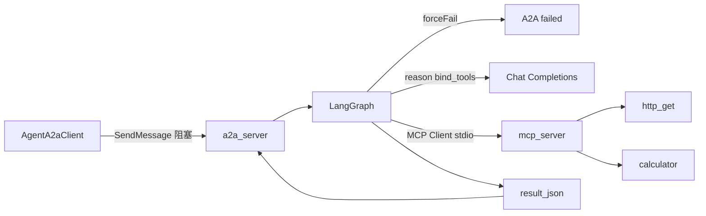
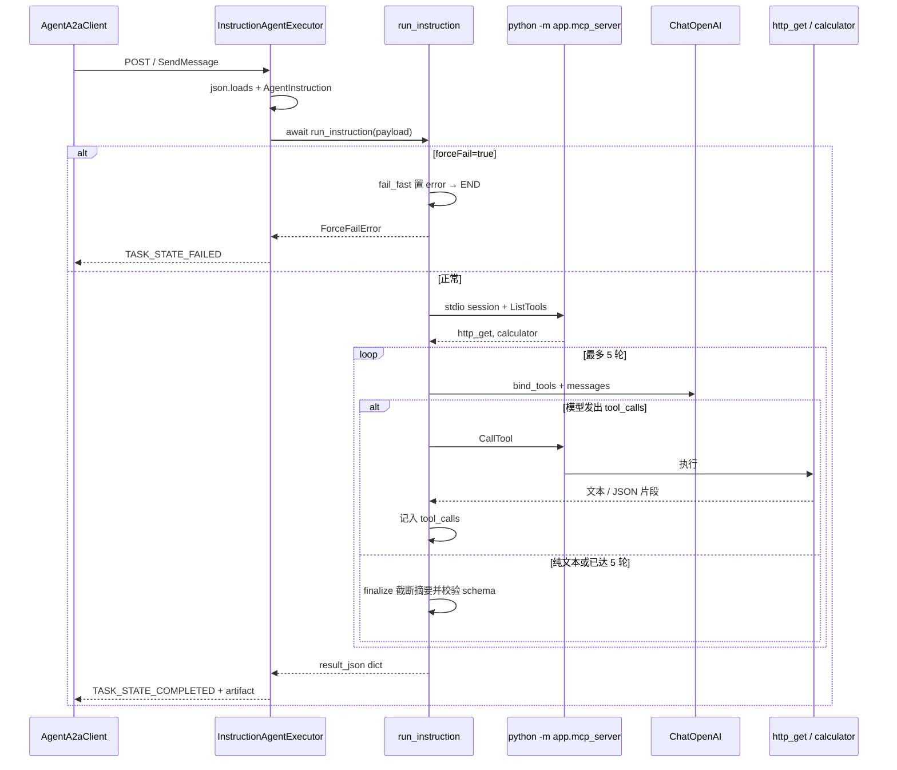

# 真 LangGraph / MCP（P2 步骤 C）

本文记录 **为什么这样改**、**每个改动文件做什么**、**一次 A2A 请求在 Python 里怎么走**。启动与 curl 以 [README.md](../../README.md) 为准；验收清单见 [P2-步骤C.md](../验证/P2-步骤C.md)；契约以 skill [python-a2a-mcp](../../.cursor/skills/python-a2a-mcp/SKILL.md) 为准。

Java 执行器（步骤 B）**没有改**。控制台表单（步骤 D）**没有改**。

## 1. 这一步要解决什么

步骤 A 让 Python 能独立回答 A2A，成功体是固定 JSON（无 LLM）。步骤 B 让 Java Worker 阻塞调用这条 A2A。步骤 C 把成功路径换成 **真 Agent**：模型用 Function Calling 选工具，工具经 **真实 MCP 协议** 执行，结果仍写回同一套 `result_json`，失败仍走 Java 的重试 / DLQ。

| 层 | 本步做了什么 | 禁止 |
|----|----------------|------|
| Python | MCP 两工具 + LangGraph 4 节点；去掉 stub | 连 MySQL / RabbitMQ；图直接调 Python 函数当工具；正则从模型文本抠 URL |
| Java | 不改 | 加 LLM SDK；用 `HTTP_CALL` 打 Agent |
| 前端 | 不改 | 浏览器直连 Agent |

本步已完成：

- MCP：仅 `http_get`、`calculator`；SSRF / 表达式白名单与 rule 一致
- LangGraph：`fail_fast` → `reason` ⇄ `tools`（最多 5 轮）→ `finalize`
- `forceFail=true` → 仍 A2A Task failed，不调模型、不启 MCP
- 成功 `result_json`：`summary` 非空，`toolCalls` 为数组；httpbin 指令应含 `http_get`
- 需要 `AI_BASE_URL` / `AI_API_KEY` / `AI_MODEL`（OpenAI 兼容）。未填密钥时成功路径失败，不再返回 stub



## 2. 改了哪些文件

对应 commit：`0a5bfe4` … `3282d91`（8 个，按依赖分层）。

### 2.1 运行时代码（按调用顺序读）

| 文件 | 职责 |
|------|------|
| [pyproject.toml](../../agent/pyproject.toml) | 增加 `httpx`、`mcp`、`langgraph`、`langchain-*` |
| [mcp_server/tools.py](../../agent/app/mcp_server/tools.py) | FastMCP：`http_get` + `calculator` |
| [mcp_server/__main__.py](../../agent/app/mcp_server/__main__.py) | `python -m app.mcp_server` 走 stdio |
| [mcp_server/__init__.py](../../agent/app/mcp_server/__init__.py) | 导出 `mcp` 实例 |
| [schemas.py](../../agent/app/schemas.py) | 入参 `AgentInstruction`；出参 `AgentResult` |
| [llm.py](../../agent/app/llm.py) | OpenAI 兼容 `ChatOpenAI` |
| [graph.py](../../agent/app/graph.py) | 4 节点图 + MCP Client |
| [a2a_server.py](../../agent/app/a2a_server.py) | `StubAgentExecutor` → `InstructionAgentExecutor` |
| [main.py](../../agent/app/main.py) | 进程日志；仍挂 `/health` + A2A |

### 2.2 配置与文档（不是运行时逻辑）

| 文件 | 改了什么 |
|------|----------|
| `agent/.env.example`、`deploy/.env.example` | 标明成功路径要填 `AI_*` |
| `README.md` | stub curl 换成 httpbin 演示 |
| `AGENTS.md`、skill 勾选 F23/F24 | 进度：C 完成，下一轮 D |
| [验证/P2-步骤C.md](../验证/P2-步骤C.md) | curl 验收 |
| 交接 C / D | C 标已完成；D 给下一轮 |

### 2.3 没改、但必须知道它怎么工作

| 文件 | 为什么没改 |
|------|------------|
| `config.py` | 步骤 A 已绑定 `AI_BASE_URL` / `AI_API_KEY` / `AI_MODEL` / `AGENT_JSONRPC_URL` |
| `Dockerfile` | 仍 `pip install .`，新依赖随 `pyproject.toml` 进镜像 |
| `AgentA2aClient.java` / `AgentTaskExecutor.java` | result schema 未变：`summary` + `toolCalls` 数组 |
| `HttpCallExecutor.java` | Agent 出站 HTTP 不走它；`http_get` 自己做同级 SSRF |
| `database/sql/schema.sql` | P2 不改表 |
| `ConsoleView.vue` / `types.ts` | 步骤 D |

## 3. 一次成功请求怎么走

用户 Message 的 text part 仍是 JSON 字符串（与步骤 A/B 相同）：

```json
{
  "taskId": 123,
  "instruction": "GET https://httpbin.org/json ，告诉我 HTTP 状态码以及返回 JSON 的顶层字段名。",
  "forceFail": false
}
```



关键约束：

1. **图不直接 import `http_get` / `calculator`。** 工具实现只活在 MCP Server 子进程里；图通过 `langchain-mcp-adapters` 的 Client 调它们。这是「真实 MCP」和「目录里放普通函数」的分界。
2. **选哪个工具由模型 Function Calling 决定。** 禁止用正则从 instruction 里捞 URL 再自己 GET。
3. **循环用 LangGraph 条件边**，不是 `while True` 调模型。`tool_rounds < 5` 才进 `tools` 节点。
4. **`finalize` 不得把模型长文当 `summary`。** 空白折叠后截到 240 字；Java 只强制 `summary` 非空且 `toolCalls` 是数组。
5. **`forceFail` 仍走 A2A failed。** `fail_fast` 直接结束，不启 MCP、不调 LLM。Java 把它当成 `execute()` 抛错，进现有 `handleFailure`。

## 4. 按文件讲解

### 4.1 `pyproject.toml`：为什么多这些包

步骤 A 只有 FastAPI + `a2a-sdk`。步骤 C 要三件事：出站 HTTP、MCP 协议、带工具的 Chat 模型。

| 依赖 | 用途 |
|------|------|
| `httpx` | `http_get` 的 GET（超时 10s、不跟重定向、不读环境代理） |
| `mcp>=1.9,<2` | 官方 MCP Python SDK 的 `FastMCP` |
| `langchain-mcp-adapters` | 把 MCP 工具转成 LangChain `BaseTool` |
| `langgraph` | 状态图 + 条件边 |
| `langchain-core` / `langchain-openai` | `ChatOpenAI.bind_tools`；**没有**再包一层业务 Chain |

`mcp` 上限 `<2`：当时适配器还吃 1.x。镜像构建仍是 Dockerfile 里 `pip install .`，密钥不进镜像。

### 4.2 `mcp_server/tools.py`：两个工具本身

`FastMCP("async-forge-tools")` 注册恰好两个 `@mcp.tool()`。装饰器生成 MCP 的 JSON Schema；docstring 会给模型看，所以写清楚「只允许公网 HTTP」「只允许四则运算」。

#### `http_get(url) → JSON 字符串`

契约：[langgraph-mcp.md](../../.cursor/skills/python-a2a-mcp/langgraph-mcp.md)。

1. `_assert_public_http_url`：只 `http`/`https`；拒无 host、`localhost`、`*.local`、云 metadata 主机名。
2. `socket.getaddrinfo` 解析 **全部** 地址，再按 Python `ipaddress` 判断 loopback / link-local / private / reserved / multicast。IPv4-mapped IPv6 先还原成 IPv4。这与 Java `HttpCallExecutor` 同级，**不**放宽到 Docker 内网（`172.16/12` 也是 private）。
3. `httpx`：`follow_redirects=False`（避免 302 到内网绕过 SSRF）、`trust_env=False`（忽略 `HTTP_PROXY`）、超时 10s。响应体最多读约 2KB 再截成 1024 字符。
4. 返回 `{"statusCode", "bodySnippet"}` 的 JSON **字符串**，方便 MCP 文本通道和后续 `outputSnippet`。

HTTP 4xx/5xx 仍算工具执行成功（`ok: true`），把状态码交给模型摘要。真正失败的是 SSRF、DNS、超时：抛 `ValueError`，图里记 `ok: false`。

#### `calculator(expression) → 数字字符串`

字符白名单：数字与 `+ - * / ( ) .` 与空白。`1e2`、`**`、`//`、`eval` 用的名字都进不来。

即便字符合法，AST 仍只接受 `Constant` / `UnaryOp(+/-)` / `BinOp(+-*/)`。`1//2` 字符全合法，但节点是 `FloorDiv`，会被拒。求值是自己走 AST，**不是** `eval()`。

除零、NaN、Inf 报错。整数结果去掉 `.0`，方便模型当普通数字用。

图 **禁止** `from app.mcp_server.tools import http_get`。这些函数只给 MCP Server 调。

### 4.3 `mcp_server/__main__.py` 与 `__init__.py`：stdio 子进程

图里启动：

```text
sys.executable -m app.mcp_server
cwd = agent 根目录（Docker 里是 /app）
```

`__main__.py` 调用 `mcp.run(transport="stdio")`。MCP 协议占用子进程的 **stdout**，所以日志一律打到 **stderr**，并关掉 httpx 的 INFO，避免污染 JSON-RPC。

`__init__.py` 只导出 `mcp`，给 `-m app.mcp_server` 一条稳定入口。

子进程环境会 `pop("AI_API_KEY")`：工具出站不需要模型密钥，避免 Key 进 MCP 进程环境。`PYTHONPATH` 补上 agent 根目录，保证容器和本机都能 `import app`。

每次非 `forceFail` 的 `run_instruction` 开 **一次** MCP session，最多 5 轮工具共用，而不是每个 tool call 再 spawn 一次（`get_tools()` 默认会那样做）。

### 4.4 `schemas.py`：进、出各一个 DTO

`AgentInstruction` 没变：A2A 文本 part 反序列化，`instruction` trim 非空，`forceFail` 默认 false。Java 侧还有长度 ≤2000 的闸。

删掉 `stub_success_result()`。换成：

| 模型 | JSON 字段 | 含义 |
|------|-----------|------|
| `ToolCallRecord` | `name`, `input`, `ok`, `outputSnippet` | 一轮真实工具调用的摘录 |
| `AgentResult` | `summary`, `finalAnswer`, `toolCalls`, `durationMs` | 写入 A2A artifact、最终进 Java `result_json` |

`populate_by_name=True` + alias，是为了 Java 要 camelCase、Python 用 snake_case。`summary` 空字符串在 Python 就会校验失败 → A2A failed → Java `handleFailure`。`toolCalls: []` 合法（指令可以不调工具）。

### 4.5 `llm.py`：只构造 Chat 模型

`get_chat_model()` 读 `Settings`（环境变量 `AI_*`）。三者任一为空 → `LlmConfigError`，文案不带 Key。

`ChatOpenAI`：

- `temperature=0`：演示要稳，httpbin 指令应走到 `http_get`
- `timeout=45`：Java A2A 总超时 60s，留给工具一点余量
- `max_retries=1`：模型挂了尽快失败，交给 Java 重试
- `max_tokens=512`：限制长文，减轻 `finalize` 截断压力

LangChain **只**做 Chat + `bind_tools`。没有 `LLMChain`、没有 RAG、没有第二套业务编排。

`forceFail` 路径不到这里，所以没密钥时强制失败演示仍能过。

### 4.6 `graph.py`：本步的核心

入口 `run_instruction(instruction) -> dict`（camelCase 的 `result_json`）。

#### 状态

`AgentState` 至少包含 skill 要求的字段：`instruction`、`force_fail`、`messages`、`tool_calls`、`summary`、`error`。另外加了 `task_id`（日志）、`tool_rounds`（封顶 5）、`final_answer`。

`messages` 用 LangGraph 的 `add_messages` 累加，不是每次覆盖。

#### 四个节点

```text
START → fail_fast → (error? END : reason) ⇄ tools → finalize → END
                         ▲                │
                         └──── 有 tool_calls 且 rounds<5
```

| 节点 | 做什么 |
|------|--------|
| `fail_fast` | `force_fail` 则 `error=forceFail=true` 并结束；否则放入 System + Human |
| `reason` | `get_chat_model().bind_tools(tools)`，把模型回复 append 进 messages |
| `tools` | 对上一条 `AIMessage.tool_calls` 逐个 `tool.ainvoke`（经 MCP）；写入 `tool_calls` 记录；回 `ToolMessage` |
| `finalize` | 从最后一条 AI 文本做短摘要；`AgentResult` 预校验；不把长文当 summary |

`reason` 缺密钥或调模型抛错时写 `error`，条件边去 `finalize`，`finalize` 见 error 直接放行，由 `_raise_if_error` 变成 `AgentRunError`。A2A 层标 failed，**不会**把半截 JSON 当 SUCCESS。

#### 为什么自己写 `tools` 节点而不用预置 `ToolNode`

预置节点能跑工具，但不按契约攒 `{name, input, ok, outputSnippet}`。这里要进 `result_json` 给 Java 展示，所以手写一轮：成功/失败都记一条，snippet 再截 1024。

MCP 适配器有时返回 LangChain 的 content block 列表（`[{type, text, id}]`），`_as_text` 抽 `text`，避免 `outputSnippet` 变成整段 block JSON。

#### `run_instruction` 的两分支

```text
forceFail
  → 编译空工具图（reason 不会跑到）
  → fail_fast → END
  → ForceFailError

否则
  → MultiServerMCPClient.session("async-forge")
  → load_mcp_tools（必须恰好 {http_get, calculator}）
  → 带这些工具编译图并 ainvoke
  → 填 durationMs，model_dump(by_alias=True)
```

`recursion_limit=20`：4 节点 × 最多 5 轮足够；防止条件边写坏时死循环。

日志：`taskId` + 工具名 + `ok` + 耗时。instruction 的截断在 A2A 层（≤200 字）。**不打 API Key。**

### 4.7 `a2a_server.py`：协议外壳没变，里面换了执行器

步骤 A 的 Card、JSON-RPC `POST /`、`SendMessage`、头 `A2A-Version: 1.0` **原样保留**。Java Client 不用改。

改动只有执行器：

| 以前 | 现在 |
|------|------|
| `StubAgentExecutor` | `InstructionAgentExecutor` |
| 同步 `run_stub()` | `await run_instruction()` |
| 只捕 `ForceFailError` | 再捕 `AgentRunError` 与未预期异常 |

未预期异常只把 **异常类名** 写进 A2A failed 消息，避免把上游错误里的 URL/密钥漏出去。非法 JSON payload 仍是 failed，不是 HTTP 500。

成功路径不变：artifact 名 `result_json` + complete 消息里同一段文本。Java `AgentA2aClient` 抽这段 JSON，`AgentTaskExecutor.requireStructuredResult` 查 `summary` 和 `toolCalls`。

### 4.8 `main.py`：进程还是那个进程

`GET /health`、`mount_a2a`、lifespan 里 `aclose()` 都没变。只加了 root logger（INFO）并压低 `httpx` / `mcp`，方便 Compose 里看 `taskId` / 工具名，又不会刷满 GET 日志。

`config.py` 未改：`AI_*` 空字符串是合法默认值；缺密钥在 `llm.py` 才变成业务失败。

### 4.9 环境变量示例

`agent/.env.example` 与 `deploy/.env.example` 只改注释：步骤 C 起成功路径必填，`forceFail` 除外。真实 Key 仍只放 gitignore 的 `deploy/.env` / `agent/.env`。Compose 里 agent 服务本来就会注入 `${AI_BASE_URL}` 等，改 `.env` 后 `docker compose up -d agent` 即可，不必改 `docker-compose.yml`。

## 5. 和 Java 怎么对上（本步不用改 Java 的原因）

Java 成功条件仍是：

- `summary` 为非空字符串
- `toolCalls` 为 JSON 数组（可 `[]`）

步骤 C 的 `AgentResult` 仍产出这两个字段，另外多了 `finalAnswer`、`durationMs`、每条 toolCall 的 `ok` / `outputSnippet`。Java 忽略多出来的字段，不少字段。

httpbin 演示是否「真的调了工具」，Java **不**强制 `toolCalls` 含 `http_get`（schema 允许空数组）。那是步骤 C 验收和 README 演示的期望，靠 System Prompt + Function Calling，不是 Java 解析 URL。

## 6. 失败怎么进死信（复习，逻辑在 Java）

```text
forceFail / 缺密钥 / 模型挂 / schema 坏
  → A2A TASK_STATE_FAILED
  → AgentA2aClient 抛错
  → TaskExecutionService.handleFailure
  → 未耗尽 max_retry：PENDING 再入队
  → 耗尽：DEAD + DLQ
```

Python 不写 `task` 表、不连 RabbitMQ。Agent 没有旁路重试策略。

## 7. 本地 / Compose 注意点

- 本机 8081 被占用时 `AGENT_PORT=8082`。容器内永远听 `8081`，Java 在 Compose 网络里必须用 `http://agent:8081`。
- 改 Python 后要 **重建镜像**：`cd deploy && docker compose build agent && docker compose up -d agent`。
- 未填 `AI_*` 时，对 Agent 发 `forceFail=false` 会 failed，文案为 `AI_BASE_URL, AI_API_KEY, and AI_MODEL are required`。这是预期，不是回归。

启动命令、httpbin curl 见 [P2-步骤C.md](../验证/P2-步骤C.md)。下一步控制台见 [P2-下一步-步骤D-控制台.md](../交接/P2-下一步-步骤D-控制台.md)。
