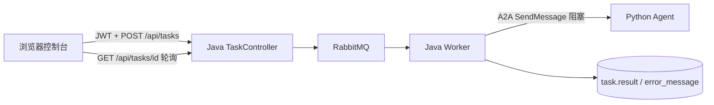
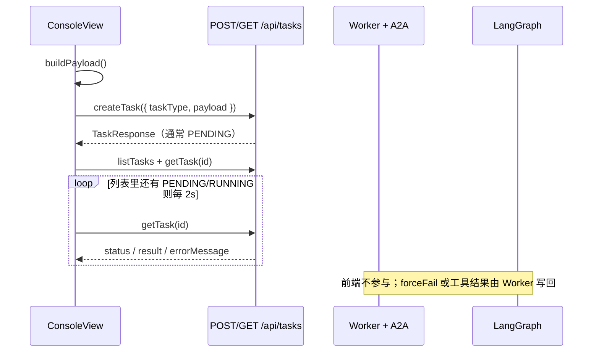

# 控制台与 README（P2 步骤 D）

本文记录 **为什么这样改**、**每个改动文件做什么**、**一次 AGENT_TASK 在浏览器里怎么走**。启动与三条 curl 以 [README.md](../../README.md) 为准；验收清单见 [P2-步骤D.md](../验证/P2-步骤D.md)；规格以 skill [implement-p2-agent](../../.cursor/skills/implement-p2-agent/SKILL.md) 步骤 D 与 [frontend-console.mdc](../../.cursor/rules/frontend-console.mdc) 为准。

Java 执行器（步骤 B）**没有改**。Python LangGraph / MCP（步骤 C）**没有改**。前端没有新页面、没有聊天窗、没有流式打字，浏览器也 **不** 请求 `AGENT_BASE_URL`。

## 1. 这一步要解决什么

步骤 A–C 已经让 `POST /api/tasks` 能提交 `AGENT_TASK`，Worker 经 A2A 调 Python，结果写回 `task` 表。步骤 D 只做两件作品集要给人看的事：

| 层 | 本步做了什么 | 禁止 |
|----|----------------|------|
| 前端 | 表单能选 `AGENT_TASK`，payload `{ instruction, forceFail }`；详情仍用 Payload / Result / Error | 直连 Agent；聊天 UI；新路由；换组件库 |
| README | 架构（Java 可靠性 × Python 智能）+ 可抄三条演示 | 两套 A2A method / 端口说法；把 Agent URL 交给 `HTTP_CALL` |
| Java / Python | 不改 | 重做执行器或图 |

本步已完成（F28 / F29）：

- 控制台提交后轮询到终态，Result 能看到 `summary` / `toolCalls`，或 Error 能看到 `errorMessage`
- README 三条：`DELAY_DEMO` 死信、Agent httpbin 成功、Agent `forceFail` → `DEAD`
- 默认指令与 [demos.md](../../.cursor/skills/implement-p2-agent/demos.md) 的 httpbin 文案对齐



浏览器只跟 Java 说话。Agent 对前端不可见。

## 2. 改了哪些文件

对应 commit：`54e3eab`（表单）、`07f9835`（README）、`3fa0f49`（进度文档）。

### 2.1 运行时代码（按阅读顺序）

| 文件 | 职责 |
|------|------|
| [types.ts](../../frontend/src/types.ts) | `TaskType` 联合类型加上 `'AGENT_TASK'`，创建请求才能编译通过 |
| [ConsoleView.vue](../../frontend/src/components/ConsoleView.vue) | 下拉、指令框、`forceFail`、按类型组 payload |
| [style.css](../../frontend/src/style.css) | 让 `textarea` 跟现有 `input` / `select` 同一套边框，不是换皮肤 |

### 2.2 文档（不是运行时逻辑）

| 文件 | 改了什么 |
|------|----------|
| [README.md](../../README.md) | 架构图、三条可抄演示、去掉 stub / 「步骤 D 还没做」 |
| [AGENTS.md](../../AGENTS.md) | 当前阶段改为 A–D 完成；入口改到步骤 D 验证 |
| [implement-p2-agent/SKILL.md](../../.cursor/skills/implement-p2-agent/SKILL.md) | 勾选 F28 / F29 |
| [验证/P2-步骤D.md](../验证/P2-步骤D.md) | 控制台与 README 验收步骤 |
| 交接 C / D | C 标明 D 也完成；D 从「下一轮待做」改成「已落地」 |

### 2.3 没改、但必须知道它怎么工作

| 文件 | 为什么没改 |
|------|------------|
| [tasks.ts](../../frontend/src/api/tasks.ts) | 已经是 `POST /api/tasks`，body 为 `{ taskType, payload }`；payload 是 `Record`，新字段不用改客户端 |
| [http.ts](../../frontend/src/api/http.ts) | 自动带 JWT；业务码 `40100` 清 session。控制台所有请求都走这里 |
| [App.vue](../../frontend/src/App.vue) / [AuthView.vue](../../frontend/src/components/AuthView.vue) | 登录壳不变；登录后才渲染 `ConsoleView` |
| [nginx.conf](../../frontend/nginx.conf) | Compose 里 `/api/` 反代到 `backend:8090`，浏览器永远打不到 `agent:8081` |
| [vite.config.ts](../../frontend/vite.config.ts) | 本机 `npm run dev` 同样把 `/api` 代理到 `localhost:8090` |
| `AgentTaskExecutor.java` / `graph.py` | 创建校验与执行语义步骤 B/C 已定；前端只组相同 JSON |
| `database/sql/schema.sql` | P2 不改表；`result` / `error_message` 已够展示 |

## 3. 一次 AGENT_TASK 从控制台怎么走

创建时浏览器发出的 JSON 与 README curl、Java `TaskServiceImpl`、Python `AgentInstruction` **同一份**：

```json
{
  "taskType": "AGENT_TASK",
  "payload": {
    "instruction": "GET https://httpbin.org/json ，告诉我 HTTP 状态码以及返回 JSON 的顶层字段名。",
    "forceFail": false
  }
}
```



关键约束：

1. **payload 在前端按类型分支，不在后端猜。** `DELAY_DEMO` 仍是 `{ seconds, fail }`，`HTTP_CALL` 仍是 `{ url }`，只有 `AGENT_TASK` 才带 `instruction` / `forceFail`。以前 `v-else` 把「非 DELAY」都当成 HTTP，加第三种类型必须拆开，否则会误传 `url`。
2. **详情面板是通用 JSON。** `selected.result` 类型是 `Record<string, unknown> | null`，`prettyJson` 直接 `JSON.stringify`。Agent 的 `summary` / `toolCalls` 不用新组件。
3. **轮询本来就按状态机工作。** `hasActive` 看列表里有没有 `PENDING` 或 `RUNNING`。`AGENT_TASK` 耗时更长（A2A 最多约 60s），但不需要为 Agent 单独写轮询。
4. **空 instruction 仍由 Java 拒绝**（业务码 `40000`）。前端 `required` + `trim` 是第一道闸；`maxlength="2000"` 对齐 `TaskServiceImpl.MAX_INSTRUCTION_LENGTH`。

## 4. 按文件讲解

### 4.1 `types.ts`：为什么只加一个字面量

```ts
export type TaskType = 'HTTP_CALL' | 'DELAY_DEMO' | 'AGENT_TASK'
```

`CreateTaskRequest.taskType` 用的是这个联合类型。不加 `'AGENT_TASK'`，`ConsoleView` 里 `taskType.value = 'AGENT_TASK'` 过不了 `vue-tsc`。

`TaskResponse.taskType` 仍是 `TaskType | string`：列表/详情来自后端 JSON，多留 `string` 是为了旧数据或未知类型仍能渲染，不把整页打挂。创建表单则收紧为 `TaskType`，避免提交拼写错误的类型名。

`payload` / `result` 继续是 `Record<string, unknown>`。步骤 D **没有** 为 Agent 另建 `AgentPayload` 接口：Java 入库的就是这一坨 JSON，前端展示也不解析 URL、不解析 `toolCalls` 结构。契约校验在 Java `requireStructuredResult`（非空 `summary` + `toolCalls` 为数组）。

### 4.2 `ConsoleView.vue`：本步的核心

页面三栏没变：左创建、中列表、右详情。改动只在创建表单和组 payload。

#### 表单状态

| ref | 用途 | 默认 |
|-----|------|------|
| `taskType` | 下拉；决定哪一块 `v-if` 和 `buildPayload` 分支 | `'DELAY_DEMO'`（与改前一致，避免打开控制台就打模型） |
| `instruction` | Agent 自然语言 | `DEFAULT_AGENT_INSTRUCTION`（demos.md 的 httpbin 句） |
| `forceFail` | Agent 强制失败 | `false` |
| `delaySeconds` / `delayFail` / `httpUrl` | 原 DELAY / HTTP 表单 | 未改语义 |

`forceFail` **不能** 复用 `delayFail`。两个 checkbox 分属两种 payload 字段（`fail` vs `forceFail`）。混用一个 ref 会在切换类型时把 DELAY 的「强制失败」带进 Agent，或反过来。

默认指令写成常量而不是 placeholder：选中 `AGENT_TASK` 就能直接点提交，对应 README「控制台选 AGENT_TASK，默认指令即可」。文案必须和 demos.md 一致，面试时 curl 与 UI 是同一句。

#### `buildPayload`

```text
DELAY_DEMO  → { seconds, fail }
HTTP_CALL   → { url: trim }
AGENT_TASK  → { instruction: trim, forceFail }
```

第三分支没有 `else if (taskType === 'AGENT_TASK')`，因为 `TaskType` 只有三种，TypeScript 在前两个 return 之后会把剩余收成 Agent。以后若加第四种类型，这里会默默走 Agent payload，那是有意保持窄：P2 不允许第四种任务类型。

`submitTask` 仍是：组 payload → `createTask` → `refreshList` → `selectTask(新 id)`。创建失败（空 instruction、401）走原来的 `formError`；`40100` 仍 `emit('logout')`。

#### 模板三分支

以前：

```text
v-if DELAY_DEMO → 秒数 + fail
v-else          → URL（把所有非 DELAY 当成 HTTP_CALL）
```

现在：

```text
v-if DELAY_DEMO      → 秒数 + delayFail
v-else-if HTTP_CALL  → URL
v-else               → instruction textarea + forceFail
```

`v-else` 对应 `AGENT_TASK`。`textarea` 的 `rows="4"`、`required`、`maxlength="2000"`：多行是因为指令是句子不是 URL；2000 与 Java 创建校验一致，超长会被浏览器拦住，不必等 `40000`。

列表行已经显示 `task.taskType` 字符串，所以 `AGENT_TASK` 会出现在「我的任务」里，不用改列表组件。

#### 详情三块为什么够用

```text
Payload  → prettyJson(selected.payload)     // 回显 instruction / forceFail
Result   → prettyJson(selected.result)      // summary、toolCalls、durationMs…
Error    → selected.errorMessage            // 仅当后端写了才出现
```

成功时 `errorMessage` 为空，Error 块不渲染。`forceFail` 耗尽重试后 `status=DEAD`，`result` 为 null（展示 `—`），Error 为 `forceFail=true` 这类 A2A 失败信息。前端 **不** 根据 `taskType` 切换详情布局。

#### 轮询

`syncPoll`：有进行中任务则每 2 秒 `listTasks` + 当前详情 `getTask`。`AGENT_TASK` 成功路径可能要十几秒到一分钟（模型 + `http_get`），失败进死信要打满 `max_retry`（默认 3）。超时上限在 Java `AGENT_TIMEOUT_SECONDS`（默认 60），与前端轮询无关。

卸载时清 `setInterval`，避免离开控制台后还打 API。

### 4.3 `style.css`：只为 textarea 补选择器

原样式只覆盖 `input` / `select`。步骤 D 第一次用 `textarea`，若不加入同一组规则，指令框会变成浏览器原生白底控件，和深色面板不一致。

改动三处，都是把 `textarea` 加进**已有**规则，外加两行让多行框可用：

| 选择器 | 作用 |
|--------|------|
| `button, input, select, textarea` | `font: inherit`，避免系统默认等宽/衬线 |
| `input…, select, textarea` | 宽 100%、内边距、边框、背景色与文字色 |
| `textarea { min-height; resize }` | `rows="4"` 之外再给一个可拖的最小高度 |
| `:focus` 加上 `textarea` | 与 input 相同的金色描边 |

没有新颜色、没有新布局、没有换组件库。rule 写明「不借机做前端美化」。

### 4.4 `README.md`：给人抄的入口，不是第二套契约

步骤 C 之后 README 还留着「固定 stub / 控制台是步骤 D / `AGENT_TIMEOUT_SECONDS` 步骤 B 才会读」这类过时句。步骤 D 按 skill 收成四块，且 A2A 仍是 **`POST /` + `SendMessage` + 头 `A2A-Version: 1.0`**，与 [a2a-contract.md](../../.cursor/skills/python-a2a-mcp/a2a-contract.md) 一致。

| 章节 | 写什么 | 刻意没写什么 |
|------|--------|----------------|
| 开篇 + **架构** | 控制台 → Java API → MQ → Worker →（仅 AGENT_TASK）A2A → Python；表说明各层禁止事项 | Multi-Agent、向量库、简历分析 |
| 快速启动 | `.env` 要填 `AI_*` 才能走成功路径；`AGENT_PORT` 被占可改，Compose 内 Java 仍是 `http://agent:8081` | 把 Key 写进示例 |
| **演示流程** 三条 | 1 DELAY 死信 2 httpbin 成功 3 forceFail 死信 | 用 `HTTP_CALL` 打 `agent:8081` |
| 可选 | DELAY 成功、HTTP_CALL 公网 GET、直连 Agent 的 JSON-RPC | 把直连 Agent 当成主演示（主路径必须经 Java） |
| 环境变量 | `AGENT_TIMEOUT_SECONDS` 已是 Java 在用的超时 | 「步骤 B 才会读取」 |

三条演示的 JSON 来自 `demos.md`，不是另编一套 instruction。空 `instruction` 返回 `40000` 写在成功演示下面，避免读者以为只有 Agent 运行时才会校验。

目录结构里 `frontend/` 从「P1，可选」改成「含 AGENT_TASK 表单」，与 F28 一致。

### 4.5 进度文档：给下一轮 Agent 看的索引

这些文件不参与运行，但决定下一轮会不会重做 D。

| 文件 | 要点 |
|------|------|
| `AGENTS.md` | 「给人类」入口从「下一轮做 D」改成「步骤 D 验证」；当前阶段写明 A–D 完成、F20–F29 勾完 |
| `implement-p2-agent/SKILL.md` | F28 / F29 打勾。工序正文仍保留「步骤 D 要改 types + ConsoleView + README」，作为历史规格，不是待办 |
| `devLog/验证/P2-步骤D.md` | 人能跟着点的清单：下拉、默认指令、Result/Error、三条 curl |
| `devLog/交接/P2-下一步-步骤D-控制台.md` | 标题改为已完成；删掉「开场必做只做 D」；保留落地清单与明确不要做 |
| `devLog/交接/P2-下一步-步骤C-真Agent.md` | 文首改成「D 也已完成」，正文仍是 C 开工时的坑，避免两份交接抢「下一步」 |

## 5. 前端怎样碰到 Java / Python（本步不用改它们的原因）

创建校验（步骤 B 已有）：

- `instruction` trim 后非空，最长 2000
- `forceFail` 缺省当 false

执行（步骤 C 已有）：

- `forceFail=true` → A2A failed → `handleFailure` → 重试耗尽 `DEAD`，`error_message` 可展示
- 成功 → `result_json` 含非空 `summary` 与数组 `toolCalls`（httpbin 演示期望其中有 `http_get`）

前端把 `result` / `errorMessage` 原样打印。它 **不** 检查 `toolCalls` 里有没有 `http_get`——那是 README / 验证清单的期望，靠模型 Function Calling，不是 UI 逻辑。

Nginx / Vite 只代理 `/api`。即使有人在控制台填 `http://agent:8081`，那也只能走 `HTTP_CALL` 任务类型，而 Java SSRF 会拦住 Docker 服务名 `agent`。步骤 D 的表单不会提供「Agent URL」字段。

## 6. Compose 前端为什么要重建镜像

`frontend/Dockerfile` 是多阶段：`npm run build` 再拷进 nginx。改 Vue 之后必须：

```bash
cd deploy
docker compose build frontend
docker compose up -d frontend
```

本机 `npm run dev` 不走镜像，改完即生效，`/api` 仍代理到 `localhost:8090`。

改 Python 才需要重建 `agent` 镜像；步骤 D 没有动 `agent/`。

## 7. 和前几步文档怎么分工

| 文档 | 读它为了什么 |
|------|----------------|
| 本文 | 步骤 D **改了哪些前端/README 文件、为什么** |
| [P2-步骤D.md](../验证/P2-步骤D.md) | 点哪里、期望看到什么 |
| [P2-步骤B-Java接入.md](P2-步骤B-Java接入.md) | Worker 如何 A2A、如何拆事务 |
| [P2-步骤C-真Agent.md](P2-步骤C-真Agent.md) | LangGraph / MCP 一次请求怎么走 |
| [README.md](../../README.md) | 启动命令与可抄 curl |
