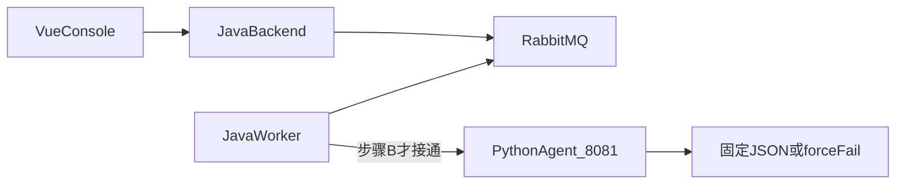
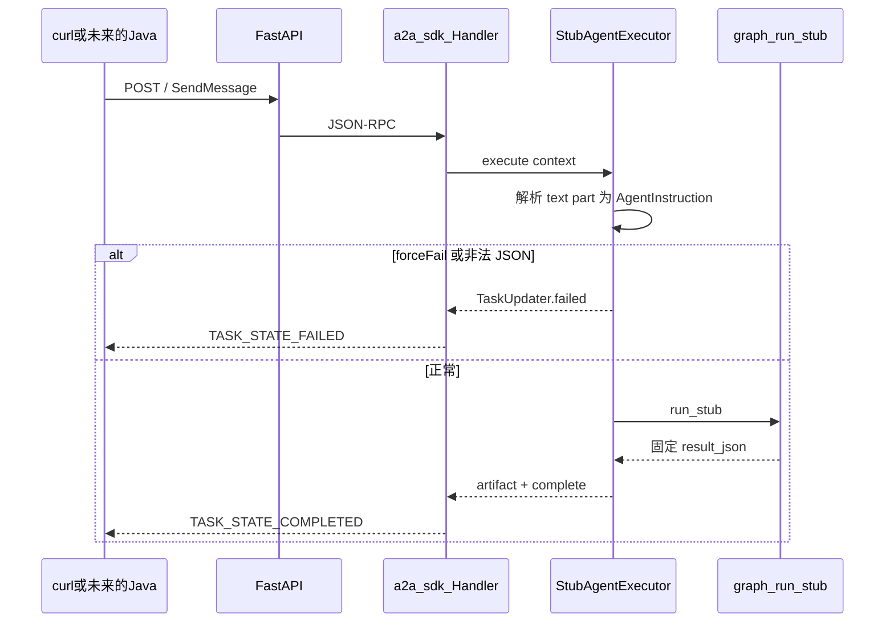

# Python Agent 骨架搭建（P2 步骤 A）

本文记录 **为什么这样搭**、**每个文件做什么**、**请求怎么走**。启动命令以 [README.md](../../README.md) 为准；Docker 启停见 [Python-Agent-Docker.md](Python-Agent-Docker.md)；A2A 字段以 [a2a-contract.md](../../.cursor/skills/python-a2a-mcp/a2a-contract.md) 为准。

## 1. 这一步要解决什么

async-forge 是异步任务平台（提交 → RabbitMQ → Worker → 可查 → 重试 / 死信）。P2 要把 **Agent 做成任务类型 `AGENT_TASK`**，而不是新平台。

分工已经定死：

| 层 | 职责 | 禁止 |
|----|------|------|
| Java | 鉴权、入库、MQ、抢占、重试、死信 | 加 LLM SDK；用 `HTTP_CALL` 打 Agent |
| Python | 智能（后续 LangGraph / MCP） | 连 MySQL / RabbitMQ |
| 前端 | 走 `/api/tasks` | 浏览器直连 Agent |

P2 按 A → B → C → D 硬顺序。**步骤 A 只让 Python 进程能独立跑起来**，给步骤 B 的 Java A2A Client 一个可对通的假成功 / 真失败。

本步已完成：

- `GET /health` → `{"status":"ok"}`（Compose healthcheck）
- `GET /.well-known/agent-card.json` 可 curl
- `forceFail=false` → A2A Task completed，固定成功 JSON（无 LLM）
- `forceFail=true` → A2A Task failed

本步 **没有**：Java `AGENT_TASK`、真 LangGraph / MCP、控制台表单、`AI_API_KEY`。



## 2. 为什么用这套技术

- **FastAPI**：项目要求 `GET /health`；再把官方 A2A 路由挂到同一进程。
- **官方 `a2a-sdk` 1.x**：主协议必须是 JSON-RPC over HTTP。禁止自造 `/api/agent/run`。
- **`pyproject.toml` 而不是 `requirements.txt`**：skill 二选一，选现代打包方式；Docker `pip install .` 与本地 `pip install -e .` 同一份依赖。
- **镜像 `python:3.12-slim`**：与 compose 约束一致；uvicorn 听 `0.0.0.0:8081`。
- **本步不装 LangGraph / MCP / LangChain**：骨架不需要模型；步骤 C 再加。

当前运行时依赖见 [agent/pyproject.toml](../../agent/pyproject.toml)：

- `fastapi`、`uvicorn[standard]`、`pydantic-settings`、`python-dotenv`
- `a2a-sdk[http-server,fastapi]>=1.1.2,<2`（需 Python ≥3.10，工程要求 3.12+）

## 3. 目录怎么铺

按 skill `implement-p2-agent` 的步骤 A 固定结构。占位文件是为了步骤 C 不必再改目录：

```text
agent/
├── Dockerfile
├── .dockerignore
├── pyproject.toml
├── .env.example          # 只放 AI_* 占位，不放真实 Key
└── app/
    ├── main.py           # FastAPI：/health + 挂载 A2A
    ├── config.py         # 环境变量
    ├── schemas.py        # A2A 文本 part 的 JSON 与固定成功体
    ├── a2a_server.py     # Agent Card、JSON-RPC、StubExecutor
    ├── graph.py          # 本步 stub（forceFail / 固定 JSON）
    ├── llm.py            # 空，步骤 C 再写
    └── mcp_server/
        └── tools.py      # 空，步骤 C 再写 http_get + calculator
```

`.gitignore` 增加 `agent/.env`、`agent/.venv`、`__pycache__`、`*.egg-info/`，避免密钥和虚拟环境进 Git。

## 4. 进程怎么启动

[agent/app/main.py](../../agent/app/main.py) 做三件事：

1. 读配置（`get_settings()`）。
2. 注册 `GET /health` → `{"status":"ok"}`。这是 Compose 探活路径，**不是** Agent Card。
3. 调用 `mount_a2a()`，把官方 SDK 的 Card 与 JSON-RPC 挂到同一个 FastAPI app。
4. `lifespan` 结束时 `aclose()` 请求处理器，避免后台任务残留。

本地：

```bash
cd agent
python3 -m venv .venv   # Python 3.12+
source .venv/bin/activate
pip install -e .
cp .env.example .env
uvicorn app.main:app --host 0.0.0.0 --port 8081
```

镜像：`python:3.12-slim` 里 `pip install .`，**不烘焙** `AI_API_KEY`。入口：

```text
uvicorn app.main:app --host 0.0.0.0 --port 8081
```

## 5. A2A 如何挂到 FastAPI

[agent/app/a2a_server.py](../../agent/app/a2a_server.py) 使用 SDK 1.x 的**路由工厂**（不再使用已删除的 `A2AFastAPIApplication` 包装类）：

1. `build_agent_card()`：名字 `async-forge-agent`，skill `run-instruction`，`streaming=false`（Java 只要一次阻塞调用）。
2. `DefaultRequestHandler(executor, InMemoryTaskStore, card)`：进程内任务存储即可；Python **不写** `task` 表。
3. `create_agent_card_routes` → `GET /.well-known/agent-card.json`
4. `create_jsonrpc_routes(..., rpc_url="/")` → `POST /`
5. `add_a2a_routes_to_fastapi` 挂到现有 FastAPI（`GET /health` 仍在）

JSON-RPC 只注册 **POST `/`**，不会挡住 GET `/health`。

### 5.1 为什么 method 不是 `message/send`

a2a-sdk **1.1.x / A2A 1.0** 的 JSON-RPC 方法名是 `SendMessage`。`message/send` 是 v0.3 名字，打到 1.0 端会 Method not found。

请求还必须带头 **`A2A-Version: 1.0`**。缺省时 SDK 会按 0.3 线格式处理。

因此先改了契约 [a2a-contract.md](../../.cursor/skills/python-a2a-mcp/a2a-contract.md)，再写代码（项目红线：偏离 method / 端口必须先改 skill）。

| 项 | 本骨架实际值 |
|----|----------------|
| 发现 | `GET /.well-known/agent-card.json` |
| JSON-RPC | `POST /` |
| method | `SendMessage` |
| 版本头 | `A2A-Version: 1.0` |
| Card 上的 JSON-RPC URL | 本地默认 `http://localhost:8081`；Compose 内 `AGENT_JSONRPC_URL=http://agent:8081` |

## 6. 一次 `SendMessage` 在骨架里怎么走

用户 Message 的 **text part 必须是 JSON 字符串**（便于 Java / Python 对齐）：

```json
{"taskId": 123, "instruction": "……", "forceFail": false}
```



[StubAgentExecutor.execute](../../agent/app/a2a_server.py) 顺序：

1. 向事件队列放入 `TASK_STATE_SUBMITTED` 的 Task（阻塞调用要等终态）。
2. `TaskUpdater.start_work()`。
3. `json.loads` + `AgentInstruction` 校验：`instruction` trim 后非空；`forceFail` 默认 false。
4. 日志只打 `taskId` + instruction 截断 ≤200 字，不打 API Key。
5. `run_stub()`：`forceFail=true` 抛 `ForceFailError` → `updater.failed`。
6. 否则把固定 JSON 写成 artifact `result_json`，再 `complete`。Java 以后校验：非空 `summary` + `toolCalls` 为数组。本步 `toolCalls` 是空数组，合法。

固定成功体（无 LLM，给步骤 B 联调）：

```json
{
  "summary": "stub: skipped LLM; instruction accepted for Java wiring.",
  "finalAnswer": "stub success",
  "toolCalls": [],
  "durationMs": 0
}
```

`graph.py` / `llm.py` / `mcp_server/tools.py` 现在不是真 Agent。步骤 C 会换成 LangGraph 3～5 节点 + MCP 两工具，并删掉这份固定 JSON。

## 7. Compose 与环境变量

[deploy/docker-compose.yml.example](../../deploy/docker-compose.yml.example) 增加 `agent` 服务：

- `build.context: ../agent`，`container_name: async-forge-agent`
- 端口 `${AGENT_PORT:-8081}:8081`，网络 `async-forge`
- healthcheck：镜像无 curl，用 Python 探 `http://127.0.0.1:8081/health`
- `AGENT_JSONRPC_URL=http://agent:8081`（写进 Agent Card，给将来的 Java 拉 Card 用）

`backend`：

- `AGENT_BASE_URL=http://agent:8081`（**写死服务名**，不要用 localhost）
- `depends_on.agent.condition: service_healthy`
- 步骤 B 起 Java 通过 `AgentProperties` / `AgentA2aClient` **读取** `AGENT_BASE_URL`；接线说明见 [P2-步骤B-Java接入.md](P2-步骤B-Java接入.md)

禁止把该 URL 交给 `HTTP_CALL`：Java 的 SSRF 会拦 Docker DNS 名 `agent`。

[deploy/.env.example](../../deploy/.env.example) 占位（无真实 Key）：

| 变量 | 用途 |
|------|------|
| `AGENT_PORT` | 宿主机映射，默认 8081 |
| `AGENT_BASE_URL` | 给 **Java** 用。Compose 内必须是 `http://agent:8081`；仅本地 Java + 宿主机 Agent 才用 `http://localhost:8081` |
| `AGENT_TIMEOUT_SECONDS` | 步骤 B 超时，默认 60 |
| `AI_BASE_URL` / `AI_API_KEY` / `AI_MODEL` | 步骤 C 才需要，骨架可留空 |

Agent 进程自己还认 `AGENT_JSONRPC_URL`（默认 `http://localhost:8081`），只影响 Card 上的广告 URL，不影响本机 `curl POST /`。

已有本地 `deploy/docker-compose.yml` 的，需要从 `.example` 再拷一次才会出现 `agent` 服务。

## 8. 核验

```bash
curl -s http://localhost:8081/health
# {"status":"ok"}

curl -s http://localhost:8081/.well-known/agent-card.json
```

成功 stub：

```bash
curl -s -X POST http://localhost:8081/ \
  -H 'Content-Type: application/json' \
  -H 'A2A-Version: 1.0' \
  -d '{"jsonrpc":"2.0","id":"1","method":"SendMessage","params":{"message":{"role":"ROLE_USER","messageId":"msg-ok","parts":[{"text":"{\"taskId\":1,\"instruction\":\"hello\",\"forceFail\":false}"}]}}}'
```

期望：`status.state` 为 `TASK_STATE_COMPLETED`，artifact / message 文本含非空 `summary` 与 `"toolCalls": []`。

失败 stub：同样信封，把 text 改成 `{"taskId":2,"instruction":"任意内容","forceFail":true}`。期望 `TASK_STATE_FAILED`。

## 9. 下一步（不做进本骨架）

| 步骤 | 内容 |
|------|------|
| B | **已完成**：Java `AGENT_TASK`、拆事务、`AgentA2aClient`。讲解：[P2-步骤B-Java接入.md](P2-步骤B-Java接入.md) |
| C | MCP `http_get` + `calculator`，LangGraph Function Calling，去掉固定 JSON |
| D | 控制台表单 + README 三条演示 |

不要：用 `HTTP_CALL` 调 Agent；Python 连 MQ；第三个 MCP 工具；聊天窗；改 `database/sql/schema.sql`。
